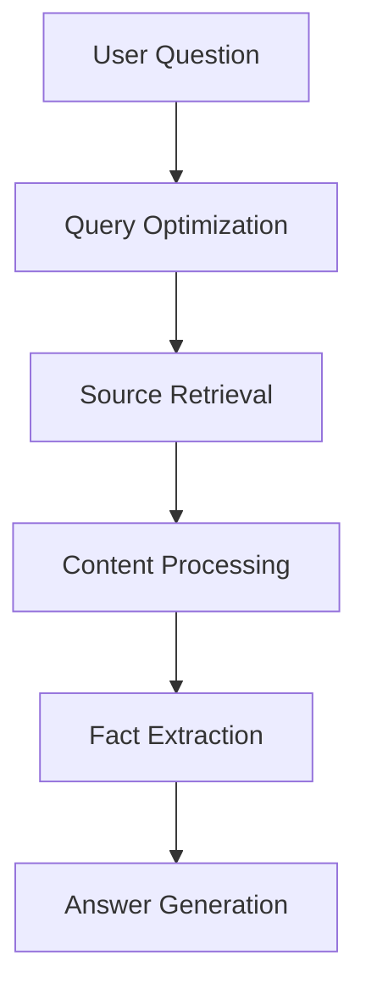

# Smart Search Engine

## Name & Description
A tool that takes a question as input and returns a comprehensive answer, along with the sources and statements used to generate the answer. It uses multiple search engines and LLM processing to provide well-researched, cited responses.

## Usage Example
```typescript
const run: Run<CONFIG, INPUTS, OUTPUT> = async (
  config: CONFIG,
  inputs: INPUTS,
): Promise<OUTPUT> => {
  // Tool execution
};
```

## Parameters/Inputs
The following parameter is required:
- `question` (string, required): The question to answer

## Config
The following configuration options are available:
- `searchEngine` (string, optional): The search engine to use (defaults to "google")
- `searchEngineApiKey` (string, optional): The API key for the search engine
- `maxSources` (number, optional): The maximum number of sources to return (defaults to 10)

## Output
The tool returns an object with the following fields:
- `response` (string, required): The generated answer
- `sources` (array, required): The sources used to generate the answer. Each source has:
  - `id` (number): Source identifier
  - `url` (string): Source URL
  - `title` (string): Source title
- `statements` (array, required): The statements extracted from the sources. Each statement has:
  - `sourceId` (number): Reference to the source
  - `sourceTitle` (string): Title of the source
  - `extractedFacts` (array): Array of facts with:
    - `statement` (string): The extracted statement
    - `relevance` (string): Relevance classification

## Implementation Details

### Pipeline Steps

1. **Query Optimization**
   - Takes the user's natural language question
   - Transforms it into an optimized search query
   - Determines the most appropriate sources (Wikipedia, WolframAlpha, etc.)
   - Ensures better search results by removing conversational elements

2. **Source Retrieval**
   - Uses Brave Search or DuckDuckGo API for Wikipedia content
   - Focuses on authoritative sources
   - Retrieves full page content for detailed analysis
   - Add other sources like StackOverflow, Generic Web Search, etc.

3. **Content Processing**
   - For each retrieved source, downloads complete page content in markdown format
   - Maintains original formatting and structure

4. **Fact Extraction**
   - Systematically analyzes source content
   - Extracts relevant statements verbatim
   - Classifies statements by relevance to the question
   - Preserves original context and accuracy

5. **Answer Generation**
   - Synthesizes information from multiple sources
   - Creates comprehensive, well-structured answers
   - Includes precise citations for every claim
   - Generates relevant follow-up questions



## Strategy Rationale

This multi-step approach is designed to:
- Ensure high-quality, accurate information from reliable sources
- Maintain academic rigor through proper citation
- Provide comprehensive answers that go beyond surface-level explanations
- Create a learning experience through follow-up questions

## Type Definitions

### Core Types

```typescript
type CONFIG = Record<string, unknown>;
type INPUTS = {
  question: string;
};
type OUTPUT = SmartSearchGenerationContext & {
  response: string;
};
```

These core types define the tool's interface:
- `CONFIG`: Extensible configuration object for future parameters
- `INPUTS`: Simple interface requiring only the user's question
- `OUTPUT`: Combines the generation context with the final response string

### Domain Types

```typescript
type PREFERRED_SOURCES = 'WIKIPEDIA' | 'WOLFRAMALPHA' | 'OTHER';

type SearchQueryConversion = {
  origin_question: string;
  preferred_sources: PREFERRED_SOURCES[];
  search_query: string;
};

interface SmartSearchSourcePage {
  url: string;
  markdown: string;
  title: string;
};

interface SmartSearchStatement {
  sourceId: number;
  sourceTitle: string;
  extractedFacts: {
    statement: string;
    relevance: 'DIRECT_ANSWER' | 'HIGHLY_RELEVANT' | 
               'SOMEWHAT_RELEVANT' | 'TANGENTIAL' | 'NOT_RELEVANT';
  }[];
}

interface SmartSearchGenerationContext {
  originalQuestion: string;
  optimizedQuery: string;
  sources: SmartSearchSourcePage[];
};
```

#### Type Details

- `PREFERRED_SOURCES`: Enum of supported search sources
  - `WIKIPEDIA`: Primary source for factual information
  - `WOLFRAMALPHA`: For computational and scientific queries
  - `OTHER`: General web sources

- `SearchQueryConversion`: Structures the optimized search query
  - `origin_question`: Preserves the original user question
  - `preferred_sources`: Array of sources to query
  - `search_query`: Optimized search terms

- `SmartSearchSourcePage`: Represents a processed source document
  - `url`: Original source URL
  - `markdown`: Processed content in markdown format
  - `title`: Source document title

- `SmartSearchStatement`: Structures extracted facts
  - `sourceId`: Unique identifier for the source
  - `sourceTitle`: Title of the source document
  - `extractedFacts`: Array of statements with relevance classification

- `SmartSearchGenerationContext`: Complete context for answer generation
  - `originalQuestion`: User's initial question
  - `optimizedQuery`: Processed search query
  - `sources`: Array of processed source pages

## Usage Example

```typescript
// Basic usage
const result = await run({}, { 
  question: "Why is the sky blue?" 
});

console.log(result.response);

// The response includes:
// - Comprehensive answer with citations
// - Follow-up questions
// - List of sources used
```

## Development

To extend the tool's capabilities:
1. TODO: Split long source content into multiple pages to appropriate length in statement extraction
2. Add new source types to `PREFERRED_SOURCES`
3. Implement corresponding search functions
4. Update the query optimization prompt
5. Modify the answer generation template if needed
